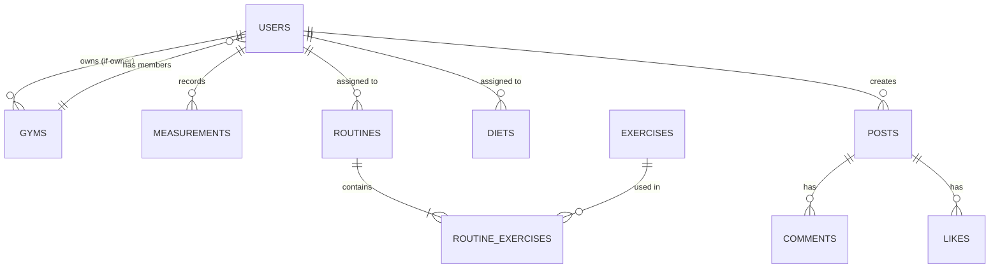

# Diseño de Base de Datos - Gym App

Este documento detalla el esquema de base de datos relacional (MySQL) diseñado para la aplicación de gestión de gimnasios.

## Diagrama Entidad-Relación (ERD) Conceptual

## Tablas Principales

### 1. Usuarios y Roles (`users`, `roles`)
Centraliza la información de todos los actores del sistema.
- **roles**: Define `super_admin`, `gym_owner`, `trainer`, `client`.
- **users**: Contiene credenciales, perfil básico y referencia al gimnasio al que pertenecen.

### 2. Gimnasios (`gyms`)
Información de los gimnasios registrados.
- Relación: Un `gym_owner` puede administrar un gimnasio. Los `users` (clientes/entrenadores) pertenecen a un gimnasio.

### 3. Entrenamiento (`exercises`, `routines`, `routine_exercises`, `workouts`)
El núcleo de la app.
- **exercises**: Catálogo global de ejercicios (ej: Press de Banca, Sentadilla).
- **routines**: Planes de entrenamiento asignados a usuarios.
- **routine_exercises**: Detalle de cada ejercicio en una rutina (series, reps, día).
- **workouts**: Registro histórico de cuando un usuario completa una rutina.

### 4. Medidas (`measurements`)
Seguimiento del progreso físico.
- Registra peso, grasa corporal, masa muscular, etc., con fecha para generar gráficas.

### 5. Nutrición (`diets`, `diet_meals`)
- **diets**: Plan general asignado.
- **diet_meals**: Detalle de comidas (Desayuno, Almuerzo, etc.) con macros.

### 6. Social (`posts`, `comments`, `likes`, `follows`)
Funcionalidades de comunidad.
- Permite interacción entre usuarios del mismo gimnasio o globalmente.

## Consideraciones de Diseño
- **UUIDs**: Se utilizarán UUIDs para las claves primarias para mayor seguridad y escalabilidad.
- **Timestamps**: Todas las tablas tendrán `created_at` y `updated_at`.
- **Integridad Referencial**: Se usarán `FOREIGN KEY` con `ON DELETE CASCADE` o `SET NULL` según corresponda para mantener la consistencia.
